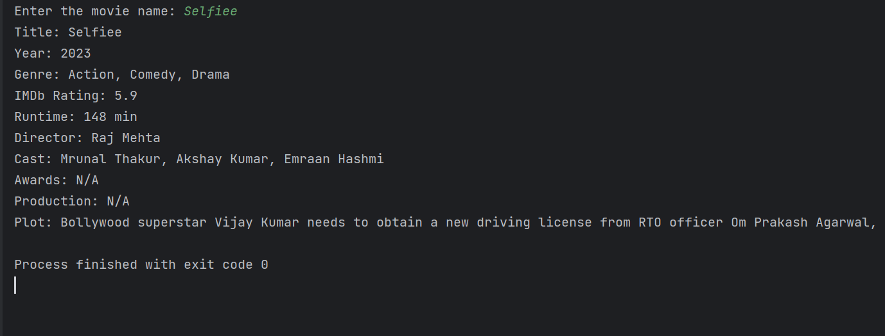

# CineInfo

CineInfo is a command-line movie information tool built in Python. It provides users with comprehensive details about movies, including release years, cast, ratings, plots, awards, and more. The project uses the Open Movie Database (OMDb) API to fetch movie information.

CLICK ON FORK THIS REPO

[](https://github.com/HacktiveMindset/CineInfo/fork)


 

## Features

- Movie Search: Enter the name of a movie to retrieve detailed information.
- Movie Recommendations: Get personalized recommendations based on user searches.

## Technologies Used

- Python
- Requests

## Getting Started
### Obtain an API Key:

   To use the OMDb API, you'll need to obtain a free API key from their website (http://www.omdbapi.com/). Sign up for an account and get your API key.
### Clone the repository:

````
git clone https://github.com/HacktiveMindset/CineInfo.git
````
### Change the directory to the project folder:

````
cd CineInfo
````
### Install required dependencies:

```
pip install -r requirements.txt
```
### Run the application:

```
python cineinfo.py
```


## Usage

1. Open a terminal and navigate to the project directory.
2. Run the application using the command provided above.
3. Enter the name of the movie you want to search.
4. View the detailed movie information displayed in the terminal.
5. Get personalized movie recommendations based on your searches.

## Project Status

The project is currently in development. Basic movie information retrieval is functional. Additional features like movie recommendations are under development.

## Contribution

Contributions to the project are welcome! If you find any bugs or have suggestions for enhancements, feel free to create an issue or submit a pull request.

## License

This project is licensed under the [MIT License](LICENSE).

## Acknowledgments

- The project uses the Open Movie Database (OMDb) API to fetch movie information.
- Thanks to the developers of Requests and other open-source libraries used in this project.
- Thanks to all the contributors and beta testers for their valuable feedback.

## Contact

For inquiries or feedback, please contact

[](https://www.instagram.com/piyush.mujmule)
